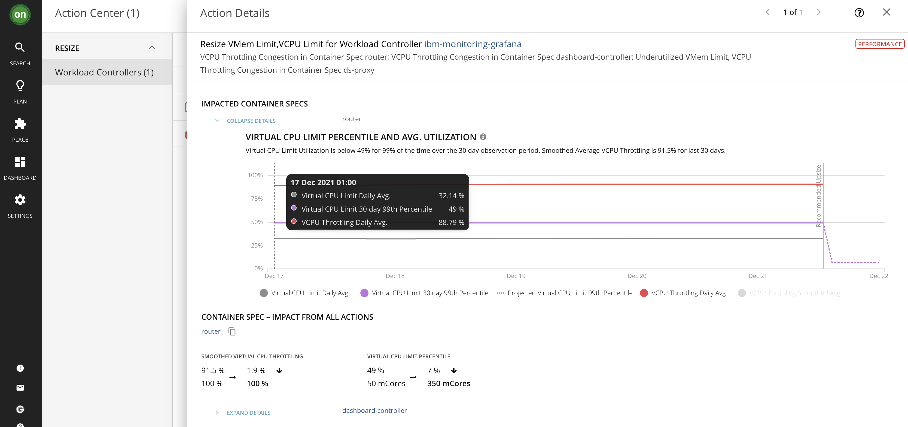

1.


2. attempt resize, kubeturbo `kubeturbo-release2-867cb5b496-lpnc4` Pod log

```log
I1221 13:14:12.039945       1 remote_mediation_client.go:214] [handleServerMessages][ServerRequestEndpoint] : received message with request type Action.
I1221 13:14:12.040833       1 action_handler.go:356] Received an action RIGHT_SIZE for entity WORKLOAD_CONTROLLER [ibm-monitoring-grafana]
I1221 13:14:12.097046       1 workload_controller_resizer.go:165] Begin to resize workload controller ibm-common-services/ibm-monitoring-grafana.
I1221 13:14:12.128302       1 resize_container_util.go:69] Try to update container router resource limit from map[cpu:{i:{value:50 scale:-3} d:{Dec:<nil>} s:50m Format:DecimalSI} memory:{i:{value:52428800 scale:0} d:{Dec:<nil>} s:50Mi Format:BinarySI}] to map[cpu:{{350 -3} {<nil>} 350m DecimalSI} memory:{{52428800 0} {<nil>} 50Mi BinarySI}]
I1221 13:14:12.131431       1 resize_container_util.go:69] Try to update container dashboard-controller resource limit from map[cpu:{i:{value:20 scale:-3} d:{Dec:<nil>} s:20m Format:DecimalSI} memory:{i:{value:83886080 scale:0} d:{Dec:<nil>} s: Format:BinarySI}] to map[cpu:{{120 -3} {<nil>} 120m DecimalSI} memory:{{83886080 0} {<nil>}  BinarySI}]
I1221 13:14:12.131729       1 resize_container_util.go:69] Try to update container ds-proxy resource limit from map[cpu:{i:{value:10 scale:-3} d:{Dec:<nil>} s:10m Format:DecimalSI} memory:{i:{value:268435456 scale:0} d:{Dec:<nil>} s: Format:BinarySI}] to map[cpu:{{10 -3} {<nil>} 10m DecimalSI} memory:{{134217728 0} {<nil>}  BinarySI}]
I1221 13:14:12.131921       1 resize_container_util.go:69] Try to update container ds-proxy resource limit from map[cpu:{i:{value:10 scale:-3} d:{Dec:<nil>} s:10m Format:DecimalSI} memory:{i:{value:134217728 scale:0} d:{Dec:<nil>} s: Format:BinarySI}] to map[cpu:{{110 -3} {<nil>} 110m DecimalSI} memory:{{134217728 0} {<nil>}  BinarySI}]
I1221 13:14:32.201042       1 resize_container_util.go:69] Try to update container router resource limit from map[cpu:{i:{value:50 scale:-3} d:{Dec:<nil>} s:50m Format:DecimalSI} memory:{i:{value:52428800 scale:0} d:{Dec:<nil>} s:50Mi Format:BinarySI}] to map[cpu:{{350 -3} {<nil>} 350m DecimalSI} memory:{{52428800 0} {<nil>} 50Mi BinarySI}]
I1221 13:14:32.201151       1 resize_container_util.go:69] Try to update container dashboard-controller resource limit from map[cpu:{i:{value:20 scale:-3} d:{Dec:<nil>} s:20m Format:DecimalSI} memory:{i:{value:83886080 scale:0} d:{Dec:<nil>} s: Format:BinarySI}] to map[cpu:{{120 -3} {<nil>} 120m DecimalSI} memory:{{83886080 0} {<nil>}  BinarySI}]
I1221 13:14:32.201202       1 resize_container_util.go:69] Try to update container ds-proxy resource limit from map[cpu:{i:{value:10 scale:-3} d:{Dec:<nil>} s:10m Format:DecimalSI} memory:{i:{value:268435456 scale:0} d:{Dec:<nil>} s: Format:BinarySI}] to map[cpu:{{10 -3} {<nil>} 10m DecimalSI} memory:{{134217728 0} {<nil>}  BinarySI}]
I1221 13:14:32.201202       1 resize_container_util.go:69] Try to update container ds-proxy resource limit from map[cpu:{i:{value:10 scale:-3} d:{Dec:<nil>} s:10m Format:DecimalSI} memory:{i:{value:134217728 scale:0} d:{Dec:<nil>} s: Format:BinarySI}] to map[cpu:{{110 -3} {<nil>} 110m DecimalSI} memory:{{134217728 0} {<nil>}  BinarySI}]
I1221 13:14:52.313768       1 resize_container_util.go:69] Try to update container router resource limit from map[cpu:{i:{value:50 scale:-3} d:{Dec:<nil>} s:50m Format:DecimalSI} memory:{i:{value:52428800 scale:0} d:{Dec:<nil>} s:50Mi Format:BinarySI}] to map[cpu:{{350 -3} {<nil>} 350m DecimalSI} memory:{{52428800 0} {<nil>} 50Mi BinarySI}]
I1221 13:14:52.313864       1 resize_container_util.go:69] Try to update container dashboard-controller resource limit from map[cpu:{i:{value:20 scale:-3} d:{Dec:<nil>} s:20m Format:DecimalSI} memory:{i:{value:83886080 scale:0} d:{Dec:<nil>} s: Format:BinarySI}] to map[cpu:{{120 -3} {<nil>} 120m DecimalSI} memory:{{83886080 0} {<nil>}  BinarySI}]
I1221 13:14:52.313882       1 resize_container_util.go:69] Try to update container ds-proxy resource limit from map[cpu:{i:{value:10 scale:-3} d:{Dec:<nil>} s:10m Format:DecimalSI} memory:{i:{value:268435456 scale:0} d:{Dec:<nil>} s: Format:BinarySI}] to map[cpu:{{10 -3} {<nil>} 10m DecimalSI} memory:{{134217728 0} {<nil>}  BinarySI}]
I1221 13:14:52.313882       1 resize_container_util.go:69] Try to update container ds-proxy resource limit from map[cpu:{i:{value:10 scale:-3} d:{Dec:<nil>} s:10m Format:DecimalSI} memory:{i:{value:134217728 scale:0} d:{Dec:<nil>} s: Format:BinarySI}] to map[cpu:{{110 -3} {<nil>} 110m DecimalSI} memory:{{134217728 0} {<nil>}  BinarySI}]
E1221 13:14:52.314559       1 go_util.go:88] failed after 3 attepmts, last error: operatorResourceSpec not found in operatorResourceSpecMap for operatorCR abdfdf9c-a21a-4ed0-8dc9-13480813438f
E1221 13:14:52.314599       1 workload_controller_resizer.go:168] Failed to resize workload controller ibm-common-services/ibm-monitoring-grafana.
E1221 13:14:52.314608       1 action_handler.go:230] Failed to execute action RIGHT_SIZE on WORKLOAD_CONTROLLER [ibm-monitoring-grafana]: failed after 3 attepmts, last error: operatorResourceSpec not found in operatorResourceSpecMap for operatorCR abdfdf9c-a21a-4ed0-8dc9-13480813438f
E1221 13:14:52.314628       1 action_handler.go:176] action execution error failed after 3 attepmts, last error: operatorResourceSpec not found in operatorResourceSpecMap for operatorCR abdfdf9c-a21a-4ed0-8dc9-13480813438f
E1221 13:14:52.314703       1 turbo_probe.go:201] Error executing action
```


3. Created ORM CR in `ibm-common-services` namespace

```yaml
apiVersion: turbonomic.com/v1alpha1
kind: OperatorResourceMapping
metadata:
  name: grafanas.operator.ibm.com
  labels:
    component: cpfs
spec:
  resourceMappings:
  - srcResourceSpec:
      kind: Deployment
      componentNames:
        - ibm-monitoring-grafana
    resourceMappingTemplates:
    - srcPath: .spec.template.spec.containers[?(@.name=="router")].resources
      destPath: .spec.routerConfig.resources
    - srcPath: .spec.template.spec.containers[?(@.name=="dashboard-controller")].resources
      destPath: .spec.dashboardConfig.resources
    - srcPath: .spec.template.spec.containers[?(@.name=="ds-proxy")].resources
      destPath: .spec.datasourceConfig.proxyResources.resources
    - srcPath: .spec.template.spec.containers[?(@.name=="grafana")].resources
      destPath: .spec.grafanaConfig.resources
```

4. Still error

```log
I1221 14:15:15.661086       1 action_handler.go:356] Received an action RIGHT_SIZE for entity WORKLOAD_CONTROLLER [ibm-monitoring-grafana]
I1221 14:15:15.692892       1 workload_controller_resizer.go:165] Begin to resize workload controller ibm-common-services/ibm-monitoring-grafana.
I1221 14:15:15.719150       1 resize_container_util.go:69] Try to update container router resource limit from map[cpu:{i:{value:50 scale:-3} d:{Dec:<nil>} s:50m Format:DecimalSI} memory:{i:{value:52428800 scale:0} d:{Dec:<nil>} s:50Mi Format:BinarySI}] to map[cpu:{{350 -3} {<nil>} 350m DecimalSI} memory:{{52428800 0} {<nil>} 50Mi BinarySI}]
I1221 14:15:15.719216       1 resize_container_util.go:69] Try to update container dashboard-controller resource limit from map[cpu:{i:{value:20 scale:-3} d:{Dec:<nil>} s:20m Format:DecimalSI} memory:{i:{value:83886080 scale:0} d:{Dec:<nil>} s: Format:BinarySI}] to map[cpu:{{120 -3} {<nil>} 120m DecimalSI} memory:{{83886080 0} {<nil>}  BinarySI}]
I1221 14:15:15.719252       1 resize_container_util.go:69] Try to update container ds-proxy resource limit from map[cpu:{i:{value:10 scale:-3} d:{Dec:<nil>} s:10m Format:DecimalSI} memory:{i:{value:268435456 scale:0} d:{Dec:<nil>} s: Format:BinarySI}] to map[cpu:{{10 -3} {<nil>} 10m DecimalSI} memory:{{134217728 0} {<nil>}  BinarySI}]
I1221 14:15:15.719284       1 resize_container_util.go:69] Try to update container ds-proxy resource limit from map[cpu:{i:{value:10 scale:-3} d:{Dec:<nil>} s:10m Format:DecimalSI} memory:{i:{value:134217728 scale:0} d:{Dec:<nil>} s: Format:BinarySI}] to map[cpu:{{110 -3} {<nil>} 110m DecimalSI} memory:{{134217728 0} {<nil>}  BinarySI}]
I1221 14:15:35.742236       1 resize_container_util.go:69] Try to update container router resource limit from map[cpu:{i:{value:50 scale:-3} d:{Dec:<nil>} s:50m Format:DecimalSI} memory:{i:{value:52428800 scale:0} d:{Dec:<nil>} s:50Mi Format:BinarySI}] to map[cpu:{{350 -3} {<nil>} 350m DecimalSI} memory:{{52428800 0} {<nil>} 50Mi BinarySI}]
I1221 14:15:35.742410       1 resize_container_util.go:69] Try to update container dashboard-controller resource limit from map[cpu:{i:{value:20 scale:-3} d:{Dec:<nil>} s:20m Format:DecimalSI} memory:{i:{value:83886080 scale:0} d:{Dec:<nil>} s: Format:BinarySI}] to map[cpu:{{120 -3} {<nil>} 120m DecimalSI} memory:{{83886080 0} {<nil>}  BinarySI}]
I1221 14:15:35.742503       1 resize_container_util.go:69] Try to update container ds-proxy resource limit from map[cpu:{i:{value:10 scale:-3} d:{Dec:<nil>} s:10m Format:DecimalSI} memory:{i:{value:268435456 scale:0} d:{Dec:<nil>} s: Format:BinarySI}] to map[cpu:{{10 -3} {<nil>} 10m DecimalSI} memory:{{134217728 0} {<nil>}  BinarySI}]
I1221 14:15:35.742586       1 resize_container_util.go:69] Try to update container ds-proxy resource limit from map[cpu:{i:{value:10 scale:-3} d:{Dec:<nil>} s:10m Format:DecimalSI} memory:{i:{value:134217728 scale:0} d:{Dec:<nil>} s: Format:BinarySI}] to map[cpu:{{110 -3} {<nil>} 110m DecimalSI} memory:{{134217728 0} {<nil>}  BinarySI}]
I1221 14:15:55.766641       1 resize_container_util.go:69] Try to update container router resource limit from map[cpu:{i:{value:50 scale:-3} d:{Dec:<nil>} s:50m Format:DecimalSI} memory:{i:{value:52428800 scale:0} d:{Dec:<nil>} s:50Mi Format:BinarySI}] to map[cpu:{{350 -3} {<nil>} 350m DecimalSI} memory:{{52428800 0} {<nil>} 50Mi BinarySI}]
I1221 14:15:55.766746       1 resize_container_util.go:69] Try to update container dashboard-controller resource limit from map[cpu:{i:{value:20 scale:-3} d:{Dec:<nil>} s:20m Format:DecimalSI} memory:{i:{value:83886080 scale:0} d:{Dec:<nil>} s: Format:BinarySI}] to map[cpu:{{120 -3} {<nil>} 120m DecimalSI} memory:{{83886080 0} {<nil>}  BinarySI}]
I1221 14:15:55.766773       1 resize_container_util.go:69] Try to update container ds-proxy resource limit from map[cpu:{i:{value:10 scale:-3} d:{Dec:<nil>} s:10m Format:DecimalSI} memory:{i:{value:268435456 scale:0} d:{Dec:<nil>} s: Format:BinarySI}] to map[cpu:{{10 -3} {<nil>} 10m DecimalSI} memory:{{134217728 0} {<nil>}  BinarySI}]
I1221 14:15:55.766788       1 resize_container_util.go:69] Try to update container ds-proxy resource limit from map[cpu:{i:{value:10 scale:-3} d:{Dec:<nil>} s:10m Format:DecimalSI} memory:{i:{value:134217728 scale:0} d:{Dec:<nil>} s: Format:BinarySI}] to map[cpu:{{110 -3} {<nil>} 110m DecimalSI} memory:{{134217728 0} {<nil>}  BinarySI}]
E1221 14:15:55.769053       1 go_util.go:88] failed after 3 attepmts, last error: operatorResourceSpec not found in operatorResourceSpecMap for operatorCR abdfdf9c-a21a-4ed0-8dc9-13480813438f
E1221 14:15:55.769540       1 workload_controller_resizer.go:168] Failed to resize workload controller ibm-common-services/ibm-monitoring-grafana.
E1221 14:15:55.769696       1 action_handler.go:230] Failed to execute action RIGHT_SIZE on WORKLOAD_CONTROLLER [ibm-monitoring-grafana]: failed after 3 attepmts, last error: operatorResourceSpec not found in operatorResourceSpecMap for operatorCR abdfdf9c-a21a-4ed0-8dc9-13480813438f
E1221 14:15:55.770074       1 action_handler.go:176] action execution error failed after 3 attepmts, last error: operatorResourceSpec not found in operatorResourceSpecMap for operatorCR abdfdf9c-a21a-4ed0-8dc9-13480813438f
E1221 14:15:55.770214       1 turbo_probe.go:201] Error executing action

```

## Questions

- how to resize operators (given their sizes are specified in their CSV file, managed by OLM)?
- what defined the 'Application' in Turbo?

- in ORM definition: Deployment, ReplicaSet or StatefulSet?
- in which namespace ORM CR to be created?
- Operator managed resources control: https://github.com/turbonomic/kubeturbo/pull/441
- How to check ORM CR got 'registered'?
